# n8n workflow recipe backlog

Build these by hand in n8n. This file is diagrams and mapping, not importable workflow JSON.

Requires n8n **1.60+** and **[@j2i/n8n-nodes-j2i](https://www.npmjs.com/package/@j2i/n8n-nodes-j2i)**. Credentials: **jsontoimg API** (Bearer key). Leave Base URL as `https://app.jsontoimg.com` unless you self-host.

Tick a box when the workflow exists in your n8n instance.

---

## jsontoimg node cheat sheet

One node, four resources. Template is the Template field (list or ID), not the Payload JSON.

| Resource | Operation | Use |
|----------|-----------|-----|
| Template | Get Many | List templates (`limit` / `offset`, optional project) |
| Template | Get Schema | Named layers for a template (optional version pin) |
| Render | Create | Queue a render. Put `"wait": 60` in Payload to block until done |
| Render | Wait | Block until done or timeout (default 30s, max 60s) |
| Render | Get | Job status (do not tight-poll; rate-limited) |
| Render | Get Asset URL | Origin download URL for the job |
| Render | Download Asset | Image/PDF bytes as binary `data` |
| Batch | Create | Queue 1–50 jobs |
| Batch | Get | Batch status and child jobs (`jobs[].assetUrl` when `done`) |
| Signed Image | Sign | Mint a signed `GET /api/v1/img/{template}` URL |
| Signed Image | Sign Many | Mint 1–50 signed URLs |
| Signed Image | Download | Fetch a signed URL (no API key; retries **503**) |

Payload JSON on Create / Sign can include `format`, `layers`, `variables`, `scale`, `wait`, `webhookUrl`, `expiresIn`, `dryRun`.

```json
{
  "format": "png",
  "wait": 60,
  "layers": {
    "headline": { "text": "{{ $json.title }}" },
    "photo": { "image_url": "{{ $json.imageUrl }}" },
    "qr": { "text": "{{ $json.ticketId }}" }
  }
}
```

- Text layers: `{ "text": "…" }`
- Image / frame layers: `{ "image_url": "https://…" }` (public HTTPS or `/api/uploads/files/{id}`)
- QR / barcode (Code) layers: `{ "text": "…" }`
- `format`: `png` | `jpg` | `webp` | `avif` | `pdf` (`jpeg` aliases `jpg`)
- `dryRun: true` validates layers, no job, no credit
- Minting a signed URL does **not** consume a credit. The first unique GET does. A Render job bills when it runs. Failed jobs are free.

### Which path

| Destination | Path |
|-------------|------|
| Accepts a URL (Shopify image `src`, Airtable attachment URL, WordPress/Webflow/Notion field, email ``, `og:image`) | Render Create + `assetUrl`, or Signed Image / Sign |
| Needs bytes (Gmail attach, Google Drive, Slack file upload) | Render Download Asset, or Signed Image / Download |
| Many rows | Loop Over Items in chunks of **50** + Batch / Create, or `webhookUrl` to a second workflow |
| Job may exceed ~60s | Create **without** `wait`, pass `webhookUrl` (n8n must be publicly reachable) |

Avoid looping Render / Get. Prefer `wait` or webhooks.

The node is `usableAsTool`, so an n8n AI Agent can call it.

---

## Shared patterns

Reuse these. Concrete recipes below only differ in trigger and destination.

### P1. Sync wait

Nodes: Source > Edit Fields > jsontoimg Render/Create (`wait: 60`) > IF > Download Asset | Slack

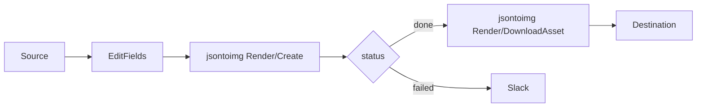

Create Payload includes `"wait": 60`. On success the JSON includes `id`, `status`, and `assetUrl` (`?sig=` works in `` with no key). Download Asset only when the next node needs binary.

### P2. URL only

Nodes: Source > Edit Fields > jsontoimg Render/Create or Signed Image/Sign > write URL back

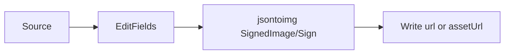

Use **Sign** for OG / CMS / email heroes (mint is free; crawler GET bills). Use **Render Create** when you need a job id, webhook, or PDF. Skip Download.

### P3. Webhook pair

Two workflows. n8n Cloud webhooks are public. Local n8n needs a tunnel. Producer sets Payload `webhookUrl` to the consumer Webhook production URL.

**Producer**

Nodes: Source > Edit Fields > jsontoimg Render/Create (`webhookUrl`, no `wait`)

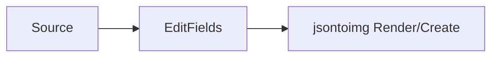

**Consumer**

Nodes: Webhook > Crypto (HMAC) > IF event > Download Asset | Slack

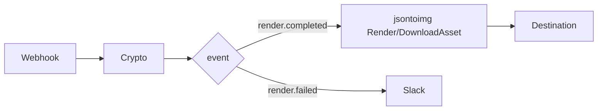

Webhook body:

```json
{
  "eventId": "…",
  "event": "render.completed",
  "data": {
    "id": "…",
    "status": "done",
    "assetUrl": "https://…/api/v1/renders/…/asset?sig=…",
    "error": null
  }
}
```

Use `eventId` for idempotency (IF already processed). When workspace webhook signing is on, header `X-Render-Signature: sha256=<hex>` is HMAC-SHA256 of the **raw JSON body**. Crypto node: SHA256, secret = workspace signing secret, compare to `<hex>`.

### P4. Batch 50

Nodes: Source Get Many > Loop Over Items (50) > Code > jsontoimg Batch/Create > jsontoimg Batch/Get > Split Out jobs > IF > write back

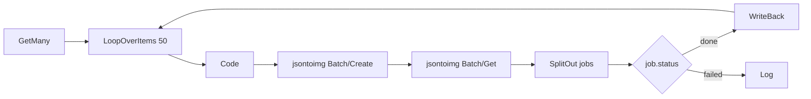

Code output is one item whose `jobs` is an array of 1–50 objects:

```json
{
  "jobs": [
    {
      "template": "<design-id>",
      "format": "jpg",
      "layers": {
        "title": { "text": "…" },
        "photo": { "image_url": "https://…" }
      }
    }
  ]
}
```

Batch / Create field **Jobs** = `{{ $json.jobs }}`. After Create, Batch / Get with `{{ $json.id }}`. If children are still queued, Wait node (n8n) then Batch / Get again — do not tight-poll. Or set `webhookUrl` on each job (P3).

### P5. Failure log

Nodes: IF failed > Google Sheets Append > Slack

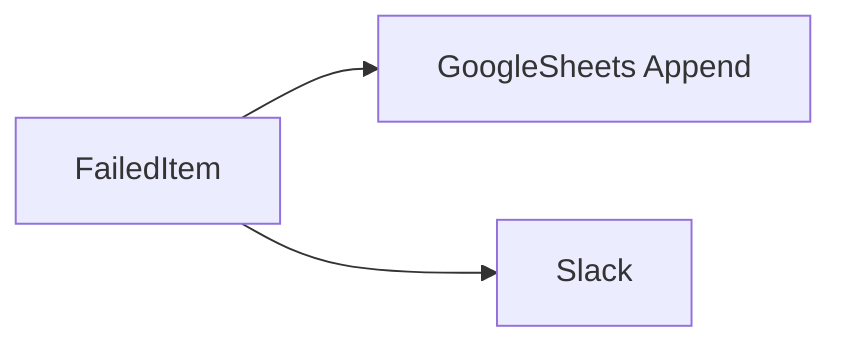

Columns: `renderId`, `eventId`, `error`, `sourceId`, `at`.

---

## Spreadsheets / bases

### Certificates from Google Sheets

- [ ] Build

Nodes: Google Sheets Trigger (row added) > Edit Fields > jsontoimg Render/Create > IF > Google Drive + Gmail + Google Sheets Update | Slack

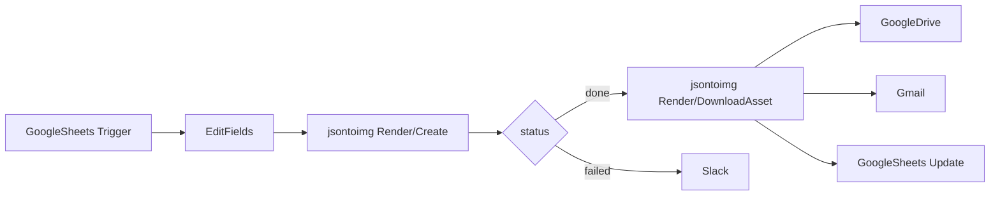

Sheet columns: `name`, `course`, `date`, `email`, `status`, `assetUrl`, `fileId`.

Create Payload:

```json
{
  "format": "pdf",
  "wait": 60,
  "layers": {
    "name": { "text": "{{ $json.name }}" },
    "course": { "text": "{{ $json.course }}" },
    "date": { "text": "{{ $json.date }}" },
    "qr": { "text": "{{ $json.row_number }}" }
  }
}
```

Pin `version` in Payload if the certificate layout is legally frozen.

| After | Node | Field |
|-------|------|-------|
| done | Google Drive | Upload binary `data`, name `{{ $json.name }}-certificate.pdf` |
| done | Gmail | Attach binary, to `{{ $json.email }}` |
| done | Google Sheets Update | `status=done`, `assetUrl`, `fileId` |
| failed | Slack | P5 |

IF `status` is still not terminal after wait, switch to P3 (webhook) instead of Render / Get.

---

### Catalog from Google Sheets

- [ ] Build

Nodes: Schedule or Manual > Google Sheets Get Many > Filter empty assetUrl > Loop Over Items (50) > Code > jsontoimg Batch/Create > jsontoimg Batch/Get > Split Out > IF > Google Sheets Update | P5

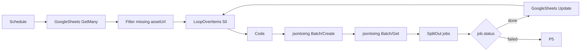

Sheet columns: `sku`, `title`, `price`, `badge`, `imageUrl`, `assetUrl`, `renderId`.

Code maps each chunk:

```json
{
  "template": "<product-banner-id>",
  "format": "jpg",
  "layers": {
    "title": { "text": "{{ title }}" },
    "price": { "text": "{{ price }}" },
    "badge": { "text": "{{ badge }}" },
    "photo": { "image_url": "{{ imageUrl }}" }
  }
}
```

Keep `badge` empty to hide a sale chip if the template uses empty-text / logic rules. 1,200 rows = 24 batches, not one POST.

---

### Social posts from Google Sheets

- [ ] Build

Nodes: Google Sheets Trigger (row added) > Edit Fields > jsontoimg Render/Create > IF > jsontoimg Render/Download Asset > Slack | Google Drive | P5

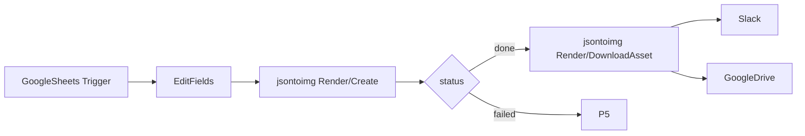

Sheet columns: `headline`, `subhead`, `imageUrl`, `channel`, `status`.

```json
{
  "format": "png",
  "wait": 60,
  "layers": {
    "headline": { "text": "{{ $json.headline }}" },
    "subhead": { "text": "{{ $json.subhead }}" },
    "photo": { "image_url": "{{ $json.imageUrl }}" }
  }
}
```

Slack posts the file for review. Do not auto-publish until someone replies (optional Slack Trigger on reaction → LinkedIn / X / Facebook).

---

### Airtable record to PNG attachment

- [ ] Build

Nodes: Airtable Trigger (new or updated) > IF status != done > Edit Fields > jsontoimg Render/Create > IF > Airtable Update | P5

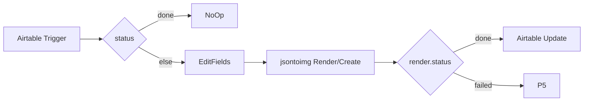

Airtable fields: `Name`, `Course`, `Date`, `Photo` (attachment), `Status`, `Preview` (attachment).

```json
{
  "format": "png",
  "wait": 60,
  "layers": {
    "name": { "text": "{{ $json.Name }}" },
    "course": { "text": "{{ $json.Course }}" },
    "date": { "text": "{{ $json.Date }}" },
    "photo": { "image_url": "{{ $json.Photo[0].url }}" }
  }
}
```

Airtable Update **Preview**: `{ "url": "{{ $json.assetUrl }}" }`. Prefer the signed `assetUrl` over Download Asset. Guard on `Status` so the write-back does not re-trigger.

---

### Airtable products to signed URLs

- [ ] Build

Nodes: Schedule > Airtable Search > Loop Over Items (50) > Code > jsontoimg Signed Image/Sign Many > Split Out urls > Airtable Update

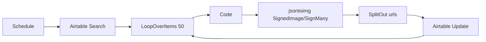

Sign Many **Jobs** (keep `recordId` in a pairing column or zip by index in Code):

```json
[
  {
    "template": "<email-hero-id>",
    "format": "jpg",
    "layers": {
      "title": { "text": "{{ Name }}" },
      "price": { "text": "{{ Price }}" },
      "photo": { "image_url": "{{ Photo[0].url }}" }
    }
  }
]
```

Write `urls[i].url` into an Airtable URL field. Mint is free. First unique GET (email client / CMS) bills. Use this column in Klaviyo / Mailchimp (see email hero recipe).

---

## Ecommerce

### Shopify product banner

- [ ] Build

Nodes: Shopify Trigger (product created or updated) > Edit Fields > jsontoimg Render/Create > IF > Shopify (create product image) | P5

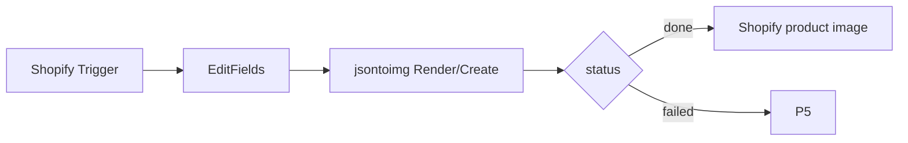

```json
{
  "format": "jpg",
  "wait": 60,
  "layers": {
    "title": { "text": "{{ $json.title }}" },
    "price": { "text": "{{ $json.variants[0].price }}" },
    "badge": { "text": "{{ $json.tags.includes('sale') ? 'SALE' : '' }}" },
    "photo": { "image_url": "{{ $json.images[0].src }}" }
  }
}
```

Shopify product image `src` = `{{ $json.assetUrl }}` (public `?sig=`). No Download Asset. If the native Shopify node cannot set image from URL, HTTP Request `POST /admin/api/2024-10/products/{{ $json.id }}/images.json` with `{ "image": { "src": "<assetUrl>", "alt": "<title>" } }`.

Optional: write `assetUrl` to a product metafield so Liquid / Klaviyo can reuse it.

IF Trigger fires on your own image write, Filter: skip when `metafields.custom.j2i_asset` is already this template version.

---

### Shopify overnight catalog

- [ ] Build

Nodes: Schedule > Shopify Get Many Products > Loop Over Items (50) > Code > jsontoimg Batch/Create > webhook or Batch/Get > Shopify image / metafield | P5

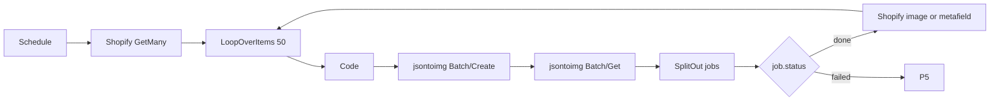

Same layer map as the product banner. Prefer P3: each job `webhookUrl` → consumer updates that product. Re-run after a brand-kit / template version change.

---

### Shopify order thank-you / ticket

- [ ] Build

Nodes: Shopify Trigger (order created) > Edit Fields > jsontoimg Render/Create > IF > jsontoimg Render/Download Asset > Gmail | P5

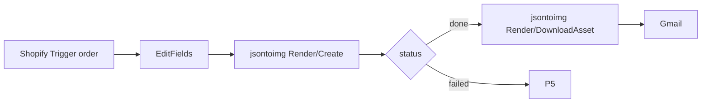

```json
{
  "format": "png",
  "wait": 60,
  "layers": {
    "name": { "text": "{{ $json.billing_address.first_name }}" },
    "order": { "text": "{{ $json.name }}" },
    "qr": { "text": "{{ $json.order_number }}" }
  }
}
```

Gmail: to `{{ $json.email }}`, attach binary. For door-scan tickets, pin `version`. PNG for email; PDF only if print is required (one credit per page).

---

### WooCommerce product banner

- [ ] Build

Nodes: WooCommerce Trigger (product updated) > Edit Fields > jsontoimg Render/Create > IF > WooCommerce Update | P5

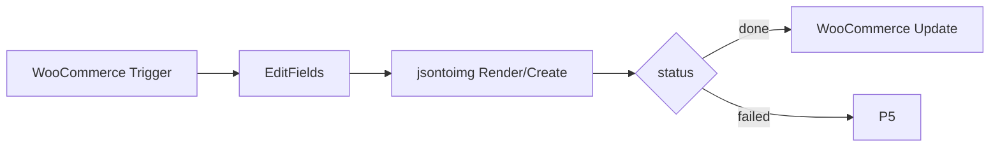

Same layers as Shopify (`name` / `price` / `badge` / `photo.image_url` from `{{ $json.images[0].src }}`). WooCommerce Update: gallery image or custom field = `assetUrl`. Same re-entry guard as Shopify.

---

## CMS / Open Graph

Signed Image / Sign is the default. You can put `url` in `og:image` immediately. First crawler GET renders (503 + Retry-After while it runs). No webhook required to ship the meta tag.

### WordPress post to og:image

- [ ] Build

Nodes: WordPress Trigger (post created/updated) or Webhook from WP > Edit Fields > jsontoimg Signed Image/Sign > WordPress Update

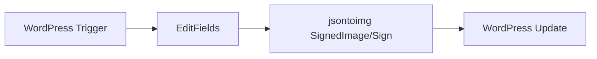

```json
{
  "format": "png",
  "layers": {
    "title": { "text": "{{ $json.title.rendered }}" },
    "author": { "text": "{{ $json._embedded.author[0].name }}" },
    "date": { "text": "{{ $json.date }}" },
    "cover": { "image_url": "{{ $json.jetpack_featured_media_url }}" }
  }
}
```

WordPress Update: Yoast / Rank Math OG field or `post_meta` `_j2i_og` = `{{ $json.url }}`. Design 1200×630. Optional `expiresIn` (seconds) if the card should rot.

---

### Notion page to share card

- [ ] Build

Nodes: Notion Trigger (page added/updated) > Edit Fields > jsontoimg Signed Image/Sign > Notion Update

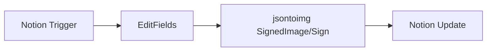

Map title / author / date / cover URL to named layers. Notion Update: URL property `OG` = `{{ $json.url }}`. Use Render Create + Download Asset only if you also upload a Notion file.

---

### Webflow CMS item to image field

- [ ] Build

Nodes: Webflow Trigger (item created/updated) > Edit Fields > jsontoimg Signed Image/Sign > Webflow Update

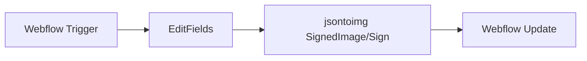

Webflow image / URL field = `{{ $json.url }}`. Same OG layer names as WordPress. Filter: skip if the OG field already equals this signed URL.

---

### RSS or GitHub release to Slack

- [ ] Build

Nodes: RSS Read or GitHub Trigger (release) > Edit Fields > jsontoimg Render/Create > IF > jsontoimg Render/Download Asset > Slack | P5

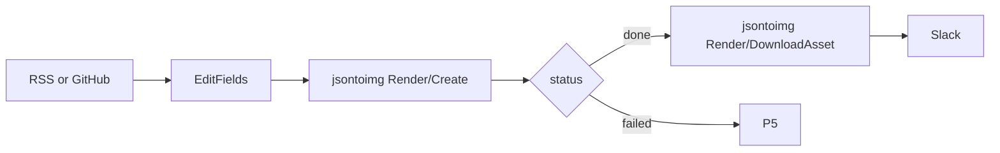

```json
{
  "format": "png",
  "wait": 60,
  "layers": {
    "headline": { "text": "{{ $json.title }}" },
    "subhead": { "text": "{{ $json.contentSnippet || $json.body }}" }
  }
}
```

Slack for review. Optional second workflow: Slack reaction → LinkedIn / X / Buffer. For CMS `og:image` use Sign instead of Download.

---

## Lifecycle / marketing

### Form to event ticket

- [ ] Build

Nodes: n8n Form Trigger or Typeform Trigger > Edit Fields > jsontoimg Render/Create > IF > jsontoimg Render/Download Asset > Gmail + Google Drive | P5

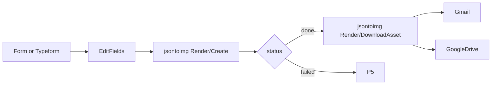

```json
{
  "format": "png",
  "wait": 60,
  "version": 3,
  "layers": {
    "name": { "text": "{{ $json.name }}" },
    "tier": { "text": "{{ $json.tier }}" },
    "seat": { "text": "{{ $json.seat }}" },
    "qr": { "text": "{{ $json.email }}|{{ $json.eventId }}" }
  }
}
```

Pin `version`. QR payload must be stable for the door app. 500 walk-ups = 500 single waits (or P3), not one batch, if they trickle in.

---

### Stripe payment to receipt / certificate

- [ ] Build

Nodes: Stripe Trigger (payment_intent.succeeded or invoice.paid) > Edit Fields > jsontoimg Render/Create > IF > jsontoimg Render/Download Asset > Gmail | P5

```mermaid
flowchart LR
  trigger["Stripe Trigger"] --> map[EditFields]
  map --> create["jsontoimg Render/Create"]
  create --> branch{"status"}
  branch -->|done| download["jsontoimg Render/DownloadAsset"]
  branch -->|failed| slack[P5]
  download --> gmail[Gmail]
```

```json
{
  "format": "png",
  "wait": 60,
  "layers": {
    "name": { "text": "{{ $json.customer_name }}" },
    "amount": { "text": "{{ $json.amount_received }}" },
    "ref": { "text": "{{ $json.id }}" }
  }
}
```

Idempotency: IF a sheet/DB already stored this `payment_intent` id, stop.

---

### HubSpot contact welcome graphic

- [ ] Build

Nodes: HubSpot Trigger (contact created) > Edit Fields > jsontoimg Render/Create > IF > Slack + Gmail | HubSpot Update | P5

```mermaid
flowchart LR
  trigger["HubSpot Trigger"] --> map[EditFields]
  map --> create["jsontoimg Render/Create"]
  create --> branch{"status"}
  branch -->|done| download["jsontoimg Render/DownloadAsset"]
  branch -->|failed| slackFail[P5]
  download --> slack[Slack]
  download --> gmail[Gmail]
  create --> hubspot["HubSpot Update"]
```

```json
{
  "format": "png",
  "wait": 60,
  "layers": {
    "name": { "text": "{{ $json.properties.firstname }}" },
    "company": { "text": "{{ $json.properties.company }}" }
  }
}
```

HubSpot Update: contact property `j2i_welcome_url` = `assetUrl` (no binary). Gmail/Slack use Download Asset.

---

### Klaviyo or Mailchimp email hero

- [ ] Build

Nodes: Schedule or Airtable/Shopify source > Loop Over Items (50) > jsontoimg Signed Image/Sign Many > Klaviyo / Mailchimp (profile or campaign image)

```mermaid
flowchart LR
  source["Airtable or Shopify"] --> loop["LoopOverItems 50"]
  loop --> signMany["jsontoimg SignedImage/SignMany"]
  signMany --> esp["Klaviyo or Mailchimp"]
  esp --> loop
```

```json
{
  "format": "jpg",
  "layers": {
    "headline": { "text": "{{ $json.firstName }}, your pick" },
    "product": { "text": "{{ $json.title }}" },
    "photo": { "image_url": "{{ $json.imageUrl }}" }
  }
}
```

Design 1200×630, display at 600px, JPEG, keep file small. Put `url` in the email `` / template image. Do not Download Asset into the ESP. First open/crawl bills.

---

### Nightly KPI thumbnail

- [ ] Build

Nodes: Schedule > Google Sheets Get or Postgres > Edit Fields > jsontoimg Render/Create > IF > jsontoimg Render/Download Asset > Slack | P5

```mermaid
flowchart LR
  schedule[Schedule] --> data["Sheets or Postgres"]
  data --> map[EditFields]
  map --> create["jsontoimg Render/Create"]
  create --> branch{"status"}
  branch -->|done| download["jsontoimg Render/DownloadAsset"]
  branch -->|failed| slackFail[P5]
  download --> slack[Slack]
```

```json
{
  "format": "png",
  "wait": 60,
  "layers": {
    "mrr": { "text": "{{ $json.mrr }}" },
    "churn": { "text": "{{ $json.churn }}" },
    "date": { "text": "{{ $json.date }}" }
  }
}
```

One row, one PNG. Slack file upload. Optional: also write `assetUrl` into a reports list (Notion / Sheets).

---

### LMS webhook to certificate

- [ ] Build

Nodes: Webhook (Thinkific / Teachable / custom LMS) > Edit Fields > jsontoimg Render/Create > IF > jsontoimg Render/Download Asset > Google Drive + Gmail | P5

```mermaid
flowchart LR
  hook[Webhook] --> map[EditFields]
  map --> create["jsontoimg Render/Create"]
  create --> branch{"status"}
  branch -->|done| download["jsontoimg Render/DownloadAsset"]
  branch -->|failed| slack[P5]
  download --> drive[GoogleDrive]
  download --> gmail[Gmail]
```

Same certificate layers as the Sheets recipe (`name`, `course`, `date`, QR). Respond to Webhook **200** quickly if the LMS retries; if the LMS wait is short, Create with `webhookUrl` (P3) and return 202 from the first workflow.

---

### Ad variants from a sheet matrix

- [ ] Build

Nodes: Manual or Schedule > Google Sheets Get Many > Code (cartesian headline × image × cta) > Loop Over Items (50) > jsontoimg Batch/Create > jsontoimg Batch/Get > Split Out > IF > jsontoimg Render/Download Asset > Google Drive | P5

```mermaid
flowchart LR
  rows["GoogleSheets GetMany"] --> cartesian[Code]
  cartesian --> loop["LoopOverItems 50"]
  loop --> batch["jsontoimg Batch/Create"]
  batch --> get["jsontoimg Batch/Get"]
  get --> split[SplitOut jobs]
  split --> branch{"job.status"}
  branch -->|done| download["jsontoimg Render/DownloadAsset"]
  branch -->|failed| log[P5]
  download --> drive[GoogleDrive]
  drive --> loop
```

Code expands rows into jobs (cap the product so each chunk is ≤50). Folder name = campaign. Upload binary; keep `assetUrl` in the sheet for the ad manager. jsontoimg does not score CTR.

Optional Batch-only Payload field `expandVariants: { "layer": "<variant-set-name>" }` if the template already has a variant set (still cannot exceed 50 jobs after expand).

---

## Platform

### AI Agent with jsontoimg

- [ ] Build

Nodes: Chat Trigger > AI Agent (jsontoimg as tool) > Slack or Respond to Chat

```mermaid
flowchart LR
  chat[ChatTrigger] --> agent[AIAgent]
  agent --> j2i["jsontoimg usableAsTool"]
  j2i --> agent
  agent --> reply[Slack or Chat]
```

Give the agent Template / Get Schema first so it maps user text onto real layer names, then Render / Create with `wait` or `dryRun: true` for a preview. Do not let it invent layer keys.

---

### render.failed webhook log

- [ ] Build

Nodes: Webhook > Crypto > IF `render.failed` > Google Sheets Append > Slack

```mermaid
flowchart LR
  hook[Webhook] --> crypto[Crypto]
  crypto --> event{"event"}
  event -->|"render.failed"| sheet["GoogleSheets Append"]
  event -->|"render.failed"| slack[Slack]
  event -->|"render.completed"| ignore[NoOp]
```

Point every producer `webhookUrl` here (or a single consumer that also handles completed). Dedup on `eventId`.

---

## Constraints

| Limit | Value |
|-------|-------|
| Batch / Sign Many size | 1–50 |
| Render / Wait timeout | max 60s (default 30) |
| Create `wait` in Payload | number of seconds; omit to queue (`async=1`) |
| Webhook | Public `https` URL; local n8n needs a tunnel |
| Credits | Sign mint free; first unique signed GET bills; Render job bills; failed jobs free |
| `dryRun` | Create Payload `true` — no job, no credit |
| n8n | 1.60+ |

---

## First-time setup (once)

- [ ] Install `@j2i/n8n-nodes-j2i`, add jsontoimg API credentials
- [ ] jsontoimg Template / Get Many → pick templates
- [ ] jsontoimg Template / Get Schema → copy layer names into every Payload above
- [ ] Build P1 + P5 on a dummy Sheet row before cloning the rest
- [ ] If any recipe uses P3, enable webhook signing in the workspace and add the Crypto check

Typical first clone: **Certificates from Google Sheets**, then **Airtable record to PNG attachment**, then **Shopify product banner**.
